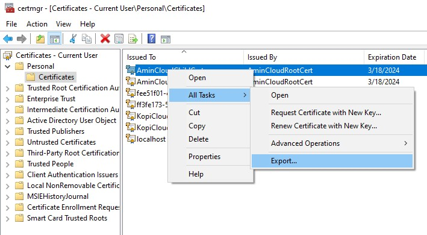

#  PoinT to Site Deployment

Este repositorio describe como hacer despliegues de máquinas virtuales que estén dentro de una VNET y que puedan ser accedidas desde una conexión VPN.

## Lista de recursos

Esta es la lista de recursos por desplegar con este script de Terraform:

|Nombre|SKU|Enlace|
|------|---|------|
|Grupo de recursos|No aplica|No aplica|
|Key Vault|Standard|[Precio](https://azure.microsoft.com/en-us/pricing/details/key-vault/)|
|Key Vault Secret|No aplica|No aplica|
|Key Vault Secret|No aplica|No aplica|
|Virtual Network|No aplica|[Link](https://azure.microsoft.com/en-us/pricing/details/virtual-network/)|
|Subnet|No aplica|No aplica|
|Subnet|No aplica|No aplica|
|Public IP|No aplica|[Link](https://azure.microsoft.com/en-us/pricing/details/ip-addresses/)|
|Virtual Network Gateway|Basic|[Link](https://azure.microsoft.com/en-us/pricing/details/vpn-gateway/)|
|Network Interface|No aplica|No aplica|
|Virtual Machine|Standard_F2|[Link](https://azure.microsoft.com/en-us/pricing/details/virtual-machines/windows/)|

## Pasos para desplegar los recursos

### Requisitos

Terraform, aquí está su [link de instalación](https://developer.hashicorp.com/terraform/tutorials/aws-get-started/install-cli).

Azure CLI, aquí está su [link de instalación](https://learn.microsoft.com/en-us/cli/azure/install-azure-cli).

Powershell (de preferencia la versión 7).

### Configurar la cuenta de Azure en Azure CLI

Una vez que se haya instalado la Azure CLI escribe el siguiente comando para ingresar tus credenciales de Azure.

```bash
azure login
```

Para confirmar que la cuenta de Azure está configurada entonces podemos confirmarlo con el siguiente comando.

```bash
azure account show
```

### Crear un certificado

Una vez que la cuenta está configurada para la linea de comandos escribe en Powershell el siguiente comando para ejecutar el script adecuado. Esto va a generar un archivo con la extensión **.pfx** dentro de la misma ubicación del script.

```powershell
> . 'C:\Users\<Usuario>\Documents\Github\PointToSiteDeployment\generate-certificate.ps1'
```


### Despliega tus recursos

Para que Terraform pueda comenzar su trabajo debe ser inicializado por medio del siguiente comando.

```bash
terraform init
```


Con Terraform inicializado podremos ver el plan de creación antes de desplgar los recursos.

```bash
terraform plan -var-file=terraform.tfvars -out=plan.out
```


Después de confirmar que ese es el plan entonces podrás ejecutar el despliegue de toda la infraestructura.

```bash
terraform apply "plan.out"
```


Ahora podrás ver todos los recursos en el portal de Azure.


### Instalando el certificado

Ya con todos los recursos creados, es momento de agregar el certificado de seguridad en el equipo que vamos a utilizar. Para ello usaremos la opción de **Administrar certificados de usuarios**.


Localiza los certificados auto firmados, cuando encuentres al que creaste (es el archivo Child) dale click derecho, todas las tareas, exportar.



Esto abrirá el asistente de **Exportación de Certificados**. En la primera opción escoge **Si, exportar la llave privada**.


En la siguiente sección deja las cosas como están para continuar. En la siguiente sección agrega una contraseña.


En la última pantalla elige el nombre del certificado por exportar y termina el proceso.


### Descarga el cliente VPN

Con el archivo **.pfx** instalado en la máquina cliente ahora es momento de volver al portal de Azure. Selecciona al **Virtual network gateway** que acabas de crear. En la opción **Point-to-site** podrás descargar el cliente.


Solo basta descargar, ejecutar y estarás listo para conectarte a la VNET desde cualquier host.